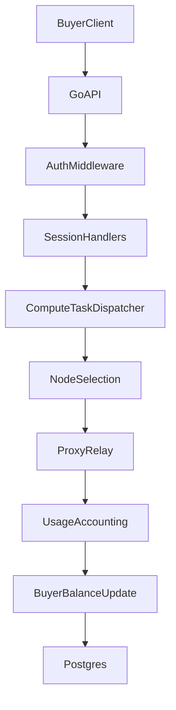
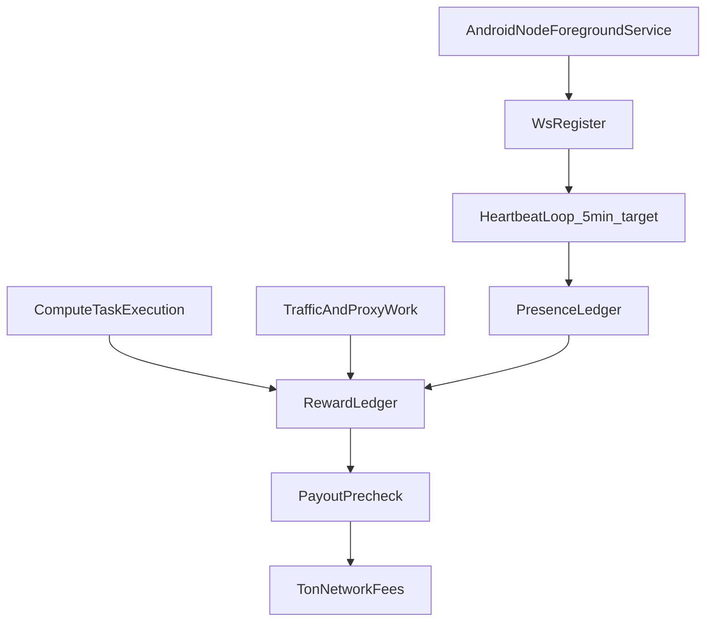

# exra Architecture

Canonical protocol policy is defined in `docs/PROTOCOL_ECONOMY_SPEC.md`.

## Recent Change Notes (2026-04)

- Token policy baseline aligned to TON economy spec: hard cap `1_000_000_000`, 12-month halving, immutable finalization intent.
- Oracle assignment path added for managed marketplace offers with locked-price settlement.
- Oracle mint queue upgraded with retry metadata (`retry_count`, `next_retry_at`, `dlq_reason`, `confirmed_at`) and reconciliation loop.
- Tokenomics ops visibility added through API monitor endpoints for oracle queue and manual retry operations.
- Instant swap flow now includes treasury protection via circuit breaker logic.

## Overview

exra is a single Go service that exposes HTTP APIs for:

- node registration and liveness,
- buyer lifecycle and balance management,
- proxy session lifecycle and traffic billing.

Data is persisted in Postgres tables: `nodes`, `buyers`, `sessions`, and `usage_logs`.

## System Positioning

- Today: decentralized proxy, node uptime network, and Compute Power Marketplace (Edge AI).
- Next: full TON mainnet integration and hardware-specific optimizations.

## Runtime Components

- Router and entrypoint: `server/main.go`
- Request auth middleware: `server/middleware/auth.go`
- API handlers: `server/handlers/*.go`
- Data access and domain logic: `server/models/*.go`
- DB bootstrap/connection: `server/db/db.go`
- Metrics & Health: `server/metrics/*.go`, `server/handlers/health.go`

## Data Flow

## Passive Income Flow (Node)

## Session and Billing Path

1. Buyer starts a session (`/api/session/start`) or submits a task (`/api/compute/submit`).
2. Traffic is relayed through `/proxy` or tasks are dispatched via WebSocket Hub.
3. Usage is stored and rewards are distributed to `node_earnings` and `pop_reward_events`.
4. Session finalization/Task completion persists final state atomically.

## Current Constraints

- Schema creation is currently triggered by service startup.
- Full 100% core test suite (Unit + Integration) verifies billing invariants.

## Economy Layer (Current + Next)

- Current:
  - node traffic is recorded from websocket `traffic` events,
  - off-chain earnings are persisted in `node_earnings`,
  - payout requests are persisted in `payout_requests`,
  - reward audit trail is persisted in `reward_events`,
  - oracle handoff queue is persisted in `oracle_mint_queue`,
  - burn accounting is persisted in `burn_events`,
  - payout precheck returns transparent gas/rent/net breakdown,
  - offer lifecycle (`offers`) and locked settlement (`sessions.locked_price_per_gb`) are active,
  - tokenomics queue monitor/retry endpoints are active for operations.
- Next:
  - add anti-abuse quality gates (tier/asn/velocity),
  - attach policy snapshot per reward event,
  - complete TON onchain oracle execution path with production keys/contracts,
  - ship full Proof of Presence reward distribution.

## Why this architecture choice

- We keep earnings off-chain first to validate economics and anti-fraud policy quickly.
- We add onchain mint/burn only after deterministic accounting is stable.
- This reduces protocol risk: we avoid irreversible onchain emissions before policy hardening.
- We enforce user-first payout UX: no platform minimums, only network economics.
