# EXRA Architecture — v2.5.0 (2026-04-26)

Canonical policy is defined in `AGENTS.md` (repository root) and refined in `docs/PROTOCOL_ECONOMY_SPEC.md`.

## Current Runtime

EXRA is a Go backend with connected clients and surfaces:

- **Node clients:** Android (production — Resident IP + Feeder Audit активны), Desktop (skeleton).
- **Buyer surface:** Next.js dashboard.
- **User surface:** Telegram Mini App (TMA, hardened).
- **Chain layer:** peaq Pallet (`pallet_exra`) + Oracle batch mint flow.

## Main Components

| Package | Role |
|---------|------|
| `server/main.go` | Router entrypoint, service init |
| `server/middleware/` | JWT/DID auth, TMA auth (jti revocation), rate limit, CORS, security headers |
| `server/handlers/` | HTTP handlers (matcher с HRW, proxy tunnel, TMA, admin) |
| `server/models/` | Business logic + SQL (DistributeReward с roundExra, FinalizeSession E3, toSubnetPrefix IPv6) |
| `server/hub/` | WebSocket hub, Redis pub/sub, PoP worker (concurrency=8) |
| `server/gateway/` | Data plane — Stitch proxy, byte accounting |
| `server/migrations/` | SQL migrations (029 applied) |
| `server/peaq/` | peaq network integration (RPC client, batch mint) |

## High-Level Data Flow

```mermaid
flowchart TD
    node[Android Node] -->|WS + DID sig| ws[Hub / WS Layer]
    ws -->|heartbeat signed| pop[PoP Worker ×8]
    pop --> db[(PostgreSQL)]
    ws -->|feeder_audit| android[Android: performFeederCheck]
    android -->|feeder_report signed| ws
    buyer[Dashboard Buyer] -->|offer| matcher[Matcher + HRW]
    matcher -->|AtomicClaimNode| redis[(Redis ZSET)]
    matcher -->|Gateway JWT| gw[Gateway / Data Plane]
    gw -->|Resident IP tunnel| node
    gw -->|byte counter| sess[FinalizeSession + E3 cross-check]
    sess --> db
    db --> oracle[Oracle Batch Jobs]
    oracle -->|batch_mint| chain[peaq pallet_exra]
    tma[Telegram Mini App] -->|TMAAuth cookie + jti| api[HTTP API]
    api --> db
```



## Reward and Settlement Flow

1. Node authenticates via DID signature (`deviceId:did:timestamp`, sr25519 "substrate" context).
2. Heartbeat every 5 min → signed `did + timestamp + sig` (mandatory, no sig = no PoP).
3. PoP worker (8 concurrent goroutines) → `DistributeReward` with `roundExra(8dp)` precision.
4. Proxy session bytes: Gateway counts buyer-side (`bytes_used`); node reports worker-side (`worker_bytes_reported`).
5. `FinalizeSession` E3 cross-check: worker > gateway → use worker; gateway > 2× worker → cap at worker.
6. Oracles aggregate signed evidence, run 2/3 consensus, queue mint.
7. Daily batch → peaq `batch_mint` extrinsic.
8. Claim: 24h timelock + 25% tax for Anon; instant for Peak.

## Resident IP (Tunnel) Flow

```
Android TunnelWorker                     Server TunnelHandler
─────────────────────                    ────────────────────
1. recv proxy_open (session_id)
2. connect targetSocket (targetHost:targetPort)
3. connect serverSocket (apiUrl)
4. HTTP GET /api/node/tunnel?session_id=X
   X-Device-ID: <deviceId>
   X-Device-Sig: sr25519(sessionId, context="substrate")
                                          5. verify sig via VerifyDIDSignature
                                          6. hijack conn, register in TunnelManager
7. bidirectional pipe (both threads)
   wait done.size >= 2 (no data loss)
8. onComplete(totalBytes)
```

## Feeder Audit Flow

```
Server                    Android Feeder            Android Target
──────                    ──────────────            ──────────────
1. AssignFeeder(targetID)
   - different /24 or /48 subnet
   - rs_mult > 0.6, stake > 10 EXRA
2. BroadcastFeederTask → WS feeder_audit {
     assignment_id, target_device_id,
     target_ip, target_port }
                          3. performFeederCheck(ip, port)
                             GET http://ip:port/health
                          4. sign("$assignmentId:$targetDeviceId:$verdict")
                          5. send feeder_report {verdict, signature}
6. VerifyDIDSignature(pubKey, signPayload, sig)
7. RecordFeederReport → EvaluateFeederConsensus (2/3 majority)
8. freeze if fraud / +20% PoP bonus if honest
```

## Sybil / Anti-Fraud

| Layer | Mechanism |
|-------|-----------|
| IP subnet | `toSubnetPrefix`: IPv4 /24 LIKE, IPv6 /48 `inet(ip) << $1::inet` |
| Peer audit | Feeder assignment: different subnet, stake > 10 EXRA, rs_mult > 0.6 |
| Canary | 5% of tasks = server health probes; failure → GS=0, burn credits |
| Mint | `roundExra(8dp)` on all streams; `workerReward = remainder` (no float leakage) |
| Node matcher | HRW `fnv32a(sessionID+nodeID)` tiebreaker ≤5% prevents hot-node clustering |

## Security-Critical Invariants

- No PoP without signed heartbeat (`verifyPopSignature` mandatory gate).
- No mint without signed oracle proof (2/3 consensus).
- TMA: jti revocation via `tma_revoked_sessions`; `log.Fatal` if `TMA_SESSION_SECRET` absent in production.
- Sybil penalty: ≥3 nodes/subnet → 0.5×, ≥10 → 0.1× (IPv4 /24 and IPv6 /48).
- Payout TOCTOU: balance check inside `SELECT FOR UPDATE` transaction.
- `FinalizeSession` E3: buyer never charged more than 2× what worker reported.
- Public APIs return only `PublicNode` — no IP, no device_id.

## Operational Notes

- Schema migrations auto-applied at server startup.
- Redis: pub/sub, node discovery ZSET, atomic claim leases, TMA session blacklist.
- `WS_ALLOWED_ORIGINS` env controls WebSocket CSRF allowlist.
- `GATEWAY_JWT_PRIVATE_KEY`/`PUBLIC_KEY`: EdDSA Ed25519 hex keys for Gateway JWT.
- Admin actions auditable via `admin_audit_logs` and peaq chain events.
