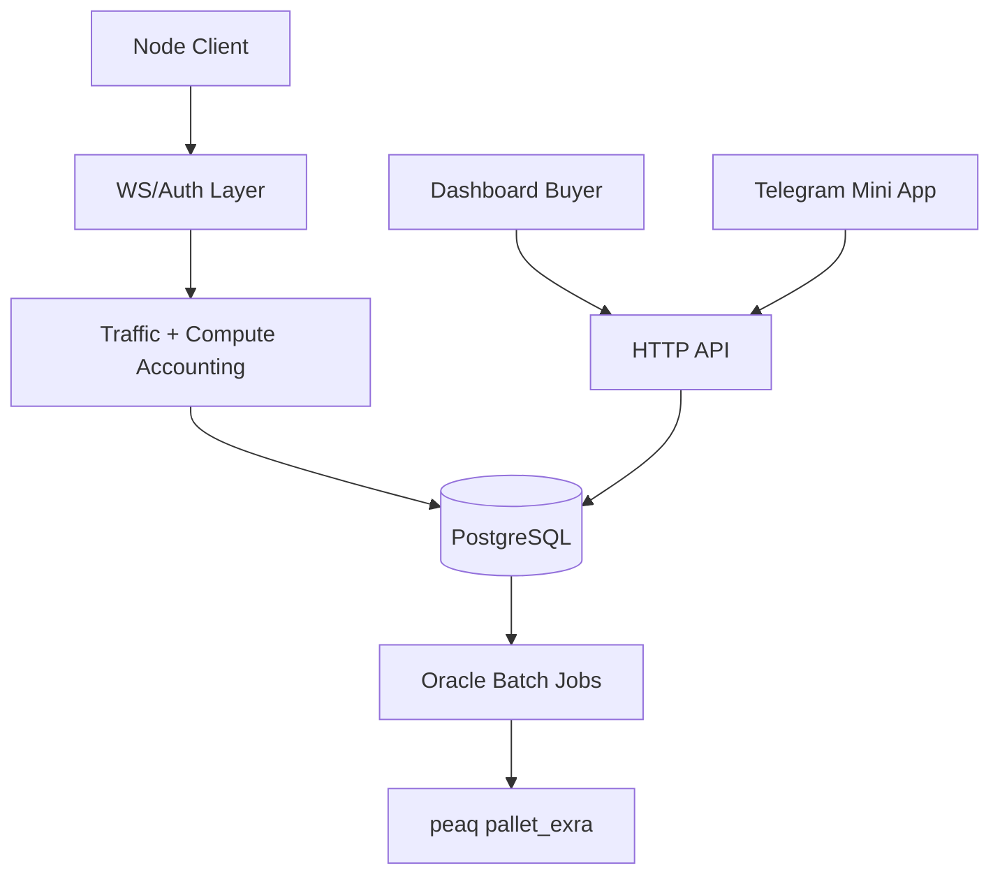

# Exra Architecture

Canonical policy is defined in `AGENTS.md` (repository root) and refined in `docs/PROTOCOL_ECONOMY_SPEC.md`.

## Current Runtime (April 2026)

Exra is a Go backend with connected clients and surfaces:

- Node clients: Android (production), Desktop (in progress).
- Buyer surface: Next.js dashboard.
- User surface: Telegram Mini App.
- Chain layer: peaq pallet + Oracle batch mint flow.

## Main Components

- API/router entrypoint: `server/main.go`
- Auth and security middleware: `server/middleware/*.go`
- HTTP handlers: `server/handlers/*.go`
- Domain and persistence logic: `server/models/*.go`
- WebSocket hub and Redis pub/sub: `server/hub/*.go`
- Migrations: `server/migrations/*.sql`
- peaq integration logic: `server/peaq/*` and `peaq/pallets/exra/*`

## High-Level Data Flow

## Reward and Settlement Flow

1. Node authenticates using `NODE_SECRET` and DID signature.
2. Heartbeat and verified work (traffic/compute) produce off-chain credits.
3. Oracles aggregate signed evidence and run cross-audit (2/3 minimum).
4. Daily batch converts Credits -> EXRA via pallet extrinsics.
5. Claim flow enforces tiered rules (timelock/tax for Anon, instant for Peak).

## Security-Critical Invariants

- No mint without signed proof.
- Sybil limits and feeder/canary anti-fraud checks are mandatory.
- Payout state transitions are transaction-safe (TOCTOU guarded).
- Public APIs must never expose node IP/device-sensitive fields.

## Operational Notes

- Schema migrations are applied during server startup.
- Redis supports pub/sub and short-lived coordination data.
- Admin actions should be auditable via admin logs and chain events.
